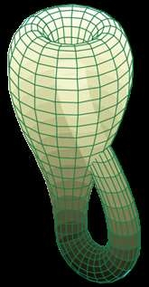

# Лабораторная работа № 4. Основы визуализации трехмерных объектов при помощи OpenGL

## ***Задание 1***

Разработайте OpenGL-приложение,
визуализирующее [правильный многогранник](http://ru.wikipedia.org/wiki/%D0%9F%D1%80%D0%B0%D0%B2%D0%B8%D0%BB%D1%8C%D0%BD%D1%8B%D0%B9_%D0%BC%D0%BD%D0%BE%D0%B3%D0%BE%D0%B3%D1%80%D0%B0%D0%BD%D0%BD%D0%B8%D0%BA)
, [полуправильный многогранник](http://ru.wikipedia.org/wiki/%D0%9F%D0%BE%D0%BB%D1%83%D0%BF%D1%80%D0%B0%D0%B2%D0%B8%D0%BB%D1%8C%D0%BD%D1%8B%D0%B9_%D0%BC%D0%BD%D0%BE%D0%B3%D0%BE%D0%B3%D1%80%D0%B0%D0%BD%D0%BD%D0%B8%D0%BA)
,
либо [звездчатый многогранник](http://ru.wikipedia.org/wiki/%D0%97%D0%B2%D1%91%D0%B7%D0%B4%D1%87%D0%B0%D1%82%D1%8B%D0%B9_%D0%BC%D0%BD%D0%BE%D0%B3%D0%BE%D0%B3%D1%80%D0%B0%D0%BD%D0%BD%D0%B8%D0%BA)
, соответствующий одному из заданных вариантов. **Смежные грани многогранника должны быть окрашены в разные цвета**. **Ребра многогранника должны
иметь черный цвет.**

#### Бонус +15 баллов за освещение

Бонус начисляется, если грани объекта будут освещены с использованием стандартных механизмов OpenGL. Для этого необходимо рассчитать вектор нормали к
каждой грани многогранника, настроить источник света и параметры материала поверхности многогранника.

#### Бонус +10 баллов за возможность вращения камеры вокруг объекта

Бонус присуждается за возможность вращения камеры вокруг объекта при помощи мыши.

#### Бонус +20 баллов за визуализацию полупрозрачных граней объекта

Бонус начисляется за визуализацию полупрозрачных граней объекта. Для вывода полупрозрачных примитивов следует воспользоваться механизмом смешивания
цветов в OpenGL. Режим спешивания цветов включается при помощи функции **glEnable** с параметром **GL\_BLEND**, а также указания нужной функции
смешивания при помощи [glBlendFunc](https://www.khronos.org/registry/OpenGL-Refpages/gl2.1/xhtml/glBlendFunc.xml). Для вывода полупрозрачных объектов
необходимо вызвать glBlendFunc с параметрами GL\_SRC\_ALPHA и GL\_ONE\_MINUS\_SRC\_ALPHA. Степень задается с помощью четвертой компоненты цвета
функции glColor4\*. Внимание, сцена, содержащая полупрозрачные объекты, для корректной визуализации должна быть нарисована следующим образом:

- Включаем тест глубины с помощью glEnable(GL\_DEPTH\_TEST) и запись в буфер глубины с
  помощью [glDepthMask](https://www.khronos.org/registry/OpenGL-Refpages/gl2.1/xhtml/glDepthMask.xml)(GL\_TRUE)
- Рисуем все непрозрачные объекты сцены (в данном случае – ребра многогранника)
- Выключаем запись в буфер глубины при помощи glDepthMask(GL\_FALSE)
- Рисуем все полупрозрачные объекты сцены, сортируя их примитивы в порядке **от дальних[^13] к ближним**. Выводиться должны как лицевые, так и
  нелицевые стороны граней объекта.

Полупрозрачный выпуклый многогранник может быть визуализирован и без необходимости сортировки[^14] его граней. При любом положении камеры нелицевые
грани выпуклого многогранника будут находиться дальше лицевых граней. Поэтому достаточно нарисовать полупрозрачный выпуклый объект за два прохода:
сначала объект рисуется в режиме отбраковки лицевых граней, а потом в режиме отбраковки нелицевых граней

```cpp
glEnable(GL\_CULL\_FACE);
glCullFace(GL\_FRONT); // отбраковываем лицевые (ближние) грани
// рисуем выпуклый многогранник
// ...
glCullFace(GL\_BACK); // отбраковываем нелицевые (дальние) грани
// рисуем этот же выпуклый многогранник
// ...
```

### Вариант 2 – [Додекаэдр](http://ru.wikipedia.org/wiki/%D0%94%D0%BE%D0%B4%D0%B5%D0%BA%D0%B0%D1%8D%D0%B4%D1%80) – 80 баллов


## ***Задание 2***

Разработайте OpenGL-приложение, визуализирующее трехмерную, функционально заданную поверхность, соответствующую одному из заданных вариантов.

Поверхность может быть визуализирована в каркасном виде, так и с помощью сплошной закраски аппроксимирующих поверхность граней.

#### Бонус в 150% за визуализацию в виде сплошной освещенной поверхности

В случае использования сплошной закраски поверхность должна визуализироваться **при включенном механизме освещения** OpenGL, для корректной работы
которого необходимо выполнить расчет **нормалей к поверхности** в вершинах полигональной сетки, аппроксимирующей поверхность. Расчет нормали можно
произвести как аналитическим способом, так и с использованием численных методов. **За корректную и качественную визуализацию поверхности с освещением
баллы, указанные в варианте, будут умножены на коэффициент 1.5**. Подберите параметры освещения и материалов таким образом, чтобы поверхность
выглядела максимально наглядным образом.

Если поверхность не является монолитным объектом, то для ее визуализации не должен включаться режим отбраковки граней (иначе будет отображена только
одна сторона поверхности)

#### Бонус в 120% за визуализацию в виде сплошной поверхности с расчетом цвета, зависящего от координат

Допускается альтернативный способ визуализации сплошной поверхности – с использованием цвета, зависящего от координат. Например, для некоторой
поверхности z=f(x,y), цвет может зависеть от координаты z (чем больше z, тем ярче цвет). Параметры отображения координат в цвета следует задать таким
образом, чтобы подчеркнуть форму и кривизну поверхности. **За качественную визуализацию сплошной поверхности, баллы, указанные в варианте задания
будут умножены на коэффициент 1.2.**

### Вариант 4 – [Лента Мёбиуса](http://ru.wikipedia.org/wiki/%D0%9B%D0%B8%D1%81%D1%82_%D0%9C%D1%91%D0%B1%D0%B8%D1%83%D1%81%D0%B0) – 120 баллов

xu,v=1+v2cosu2cosu

yu,v=1+v2cosu2sinu

zu,v=v2sinu2


### Вариант 5 – [Бутылка Клейна](http://ru.wikipedia.org/wiki/%D0%91%D1%83%D1%82%D1%8B%D0%BB%D0%BA%D0%B0_%D0%9A%D0%BB%D0%B5%D0%B9%D0%BD%D0%B0) – 120 балов

При 0≤u≤π

x=6cosu1+sinu+4r1-cosu2cosucosv

y=16sinu+4r1-cosu2sinucosv

z=4r1-cosu2sinv

При π≤u≤2π

x=6cosu1+sinu-4r1-cosu2cosv

y=16sinu

z=4r1-cosu2sinv



### Вариант 8 – [Тор](http://ru.wikipedia.org/wiki/Тор_\(поверхность\)) – 80 баллов

xα,β=R+rcosαcosβ

yα,β=R+rcosαsinβ

zα,β=rsinα

α,β∈0;2π


#### Бонус +10 баллов за возможность вращения камеры вокруг объекта

Данный бонус присуждается за возможность вращения камеры вокруг объекта при помощи мыши.